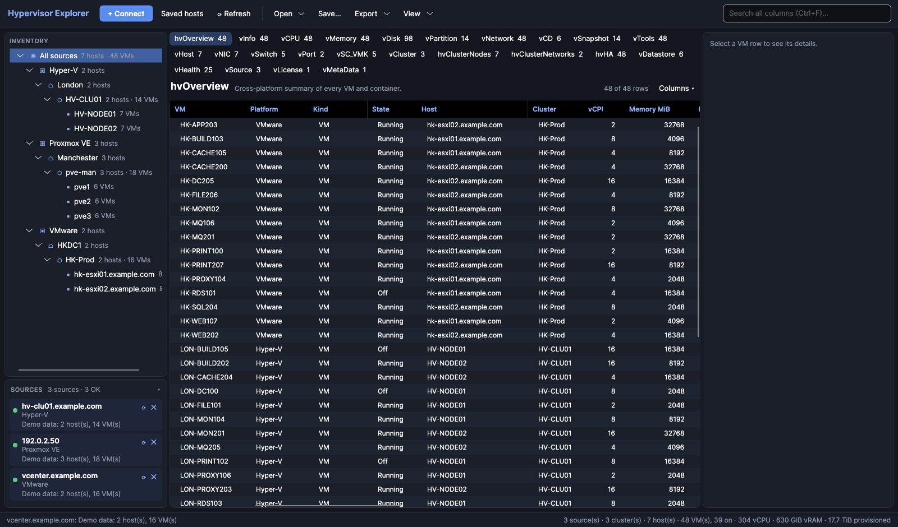

# Hypervisor Explorer

Inventory for a mixed hypervisor estate. Connect to **Microsoft Hyper-V** (including Failover Clusters), **Proxmox VE** clusters and **VMware ESXi / vCenter**. Browse everything in one interactive view, then export an **RVTools-compatible workbook**.



## Features

- **One view across platforms.** An inventory tree (platform → site → cluster → host) scopes every table to whatever you select. The whole grid is searchable, columns can be sorted, reordered and hidden, and a details panel shows the selected VM.
- **RVTools-style tables.** All 27 RVTools sheets are available, with RVTools' exact column names and order: vInfo, vCPU, vMemory, vDisk, vPartition, vNetwork, vSnapshot, vHost, vNIC, vSwitch, vDatastore, vCluster, vHealth and the rest. There are also extra tables for cross-platform overview, cluster nodes, cluster networks and HA.
- **Exports:**
  - RVTools-compatible `.xlsx` (no Excel or extra modules needed)
  - CSV of the current filtered table, or every table as a zip
  - A single-file HTML estate report
  - JSON inventory snapshots you can reopen later without reconnecting
- **Saved hosts and groups.** Credentials are encrypted per user: DPAPI on Windows, AES-GCM elsewhere. A group, such as a site or cluster, can supply shared credentials to all its hosts, and you can connect a whole group in one click.
- **Background collection.** Several sources are collected in parallel with live progress and an activity log. The window never freezes.
- **Health checks.** Old snapshots, low datastore space, guest tools not running, mounted ISOs, cluster nodes that aren't Up, CSVs in redirected access, and more.
- **CLI.** `hvexplorer` collects and exports headlessly, for Task Scheduler or cron.

## Platforms

| Platform | How it connects | Collects | Needs |
|---|---|---|---|
| **VMware vCenter / ESXi** | vSphere Web Services API on HTTPS 443, with username and password, the same way RVTools works. No SSH. | VMs, hosts, clusters (HA/DRS), datastores, standard and distributed switches, port groups, resource pools, snapshots, guest disks, licences (keys masked) | A read-only role is enough. Point it at vCenter to get the whole estate. |
| **Proxmox VE** | REST API on HTTPS 8006, with an API token or username and password | QEMU VMs and LXC containers, nodes, cluster and quorum, storage (shared and local), bridges, bonds and VLANs, snapshots, HA, and guest IPs and file systems through the QEMU guest agent | The `PVEAuditor` role on `/`. Connecting to one node collects the whole cluster. |
| **Microsoft Hyper-V** | WinRM on port 5985 (encrypted) or 5986 (HTTPS). On Windows it uses PowerShell remoting, as the current user or with credentials. On macOS and Linux a built-in WinRM client signs in with a username and password (NTLM). | VMs, VHDs, NICs and VLANs, checkpoints, integration services, host hardware, virtual switches, volumes. **Failover Cluster:** nodes, quorum, cluster networks, CSVs, VM roles with owner and preferred nodes. Every cluster node is collected automatically. | WinRM enabled on the host (`Enable-PSRemoting`) and an account with local admin rights. Hosts you can't reach can use the offline script below. |

## Getting started

1. Download the latest release (**v3.0.1**) and unzip it. Nothing needs installing: it's a self-contained .NET 10 build.
   - Windows: [HypervisorExplorer-3.0.1-win-x64.zip](https://github.com/SuperFastMart/HyperVisorExplorer/releases/download/v3.0.1/HypervisorExplorer-3.0.1-win-x64.zip). **Before extracting**, run `Unblock-File .\HypervisorExplorer-3.0.1-win-x64.zip` in PowerShell, otherwise SmartScreen blocks the unsigned exe.
   - macOS (Intel and Apple Silicon): [HypervisorExplorer-3.0.1-macos-universal.zip](https://github.com/SuperFastMart/HyperVisorExplorer/releases/download/v3.0.1/HypervisorExplorer-3.0.1-macos-universal.zip). After copying the app to Applications, run `xattr -dr com.apple.quarantine "/Applications/Hypervisor Explorer.app"` once, or use System Settings → Privacy & Security → **Open Anyway** after the first blocked launch.
   - All versions: [Releases](../../releases)
2. Run `HypervisorExplorer.exe` (or **Hypervisor Explorer.app**) and click **+ Connect**, or use **View → Load demo data** to look around first.
3. Use **Export → RVTools-compatible workbook** to produce the `.xlsx`.

The app also runs natively on macOS (one download for Intel and Apple Silicon Macs) and Linux, with the same features: VMware, Proxmox and Hyper-V can all be collected from a Mac. On macOS, sign in to Hyper-V with `DOMAIN\user` and a password; integrated Windows sign-in is only available on Windows.

### Hyper-V hosts you can't reach over WinRM

Use **Open → Save Hyper-V collection script**. Copy `Collect-HyperV.ps1` to the host and run it in an elevated PowerShell:

```powershell
.\Collect-HyperV.ps1 -OutFile hyperv.json
```

Then bring the file back and use **Open → Import Hyper-V collection file…**. The script runs on Windows PowerShell 5.1 and later.

## Command line

```text
hvexplorer collect --vmware vcenter.example.com -u readonly@vsphere.local --password-env VC_PASS -o estate.xlsx
hvexplorer collect --proxmox pve1.example.com --token -u root@pam!inventory --password-env PVE_TOKEN -o pve.json
hvexplorer collect --saved -o nightly.xlsx          # every host saved in the GUI, with stored credentials
hvexplorer convert pve.json -o pve.html             # snapshot → .xlsx / .html / .zip
hvexplorer script -o Collect-HyperV.ps1
```

The output format follows the file extension: `.xlsx`, `.json`, `.html`, or `.zip` (CSV per table). Exit codes:

| Code | Meaning |
|---|---|
| 0 | Success |
| 1 | Usage error |
| 2 | Some sources failed (output still written) |
| 3 | All sources failed |

## Building from source

Requires the [.NET 10 SDK](https://dotnet.microsoft.com/download).

```bash
dotnet test tests/HypervisorExplorer.Tests      # unit tests (collectors run against recorded API fixtures)
dotnet run --project src/HypervisorExplorer.App  # run the desktop app
pwsh ./build/publish.ps1 -Version v3.0.1         # single-file win-x64 exes + zip in artifacts/publish
./build/package-macos.sh v3.0.1                  # Hypervisor Explorer.app + hvexplorer (Intel + Apple Silicon)
```

Pushing a `v*` tag runs the GitHub Actions workflow, which tests, publishes and attaches the zip to a release.

### Repository layout

| Path | Contents |
|---|---|
| `src/HypervisorExplorer.Core` | Platform-neutral inventory model, RVTools table definitions, exporters (XLSX/CSV/HTML/JSON), config and credential store |
| `src/HypervisorExplorer.Collectors` | `HyperV/` (PowerShell remoting + embedded scripts), `Proxmox/` (REST), `VMware/` (vSphere SOAP) |
| `src/HypervisorExplorer.App` | Avalonia desktop UI |
| `src/HypervisorExplorer.Cli` | `hvexplorer` command-line tool |
| `tests/` | xUnit tests |
| `tools/HypervisorExplorer.Screenshots` | Renders the UI headlessly with demo data (the images in `docs/`) |
| `tools/FakeWinRm` | Fake WinRM endpoint (Python + pyspnego) for testing the built-in WinRM client without a Windows host |
| `legacy/` | The original PowerShell/WPF *Hyper-V Explorer v2* |

### Adding a column or platform

Every grid, CSV, XLSX sheet and HTML table comes from the same `TableDefinition`s in `Core/Tables`. To fill another RVTools column, map it once in `RvToolsTables.cs`. A collector can also set `Extra["<RVTools header>"]` on any object for platform-specific values.

## Security notes

- Saved passwords and token secrets are encrypted for your user account and never written in plain text.
- Hyper-V credentials reach the PowerShell child process through stdin, never on the command line or in environment variables. On macOS/Linux the built-in WinRM client authenticates with NTLM and encrypts every message (HTTP) or uses TLS (HTTPS); the collection script runs on the host without the password being passed to it.
- The builds are deliberately not code-signed. The unblock step above is the supported way to run them.
- TLS certificate checks are skipped by default for Proxmox and ESXi, because self-signed certificates are the norm (RVTools does the same). Untick **Accept self-signed certificates**, or pass `--strict-tls`, to enforce validation.
- Exports contain infrastructure details (hostnames, IPs, serial numbers). The `.gitignore` excludes `*.xlsx`, `*.csv` and `RVTools_*` so they don't get committed by accident.

## Documentation

The user guide (installation, connecting, exports, troubleshooting) is on Confluence: [Hypervisor Explorer (CI space)](https://loopup.atlassian.net/wiki/spaces/CI/pages/798818309).

## Status

Version 3.0 is a full C# rewrite. The VMware collector has been run against VMware's `vcsim` vSphere simulator. The Proxmox, ESXi and Hyper-V collectors have all been run against real hosts, including Hyper-V collected from macOS through the built-in WinRM client (which is also tested end to end against an independent NTLM implementation via `tools/FakeWinRm`). Failover Cluster expansion still needs its first run against a real cluster. Please open an issue with the activity-log output (**View → Show activity log**) if anything looks wrong.
